- [START](#start)
- [Application Structure(项目结构)](#application-structure项目结构)
- [Core Concepts(核心概念)](#core-concepts核心概念)
  - [1.State](#1state)
  - [Getter](#getter)
  - [Mutation](#mutation)
  - [Action](#action)
  - [Modules(模块)](#modules模块)
- [Strict Mode(严格模式)](#strict-mode严格模式)
  - [#开发环境与发布环境](#开发环境与发布环境)
- [Form Handling(表单处理)](#form-handling表单处理)
  - [#双向绑定的计算属性](#双向绑定的计算属性)
- [Plugins(插件):见文档](#plugins插件见文档)
- [Testing(测试):见文档](#testing测试见文档)
- [Hot Reloading(热重载):见文档](#hot-reloading热重载见文档)

### START

```html
<script src="https://unpkg.com/vuex@3.4.0/dist/vuex.js"></script>  <!--CDN引入 -->
```

或

```js
import Vuex from 'vuex' // Vue/cli开发
Vue.use(Vuex);
```

`Vuex`对象的内容如下:

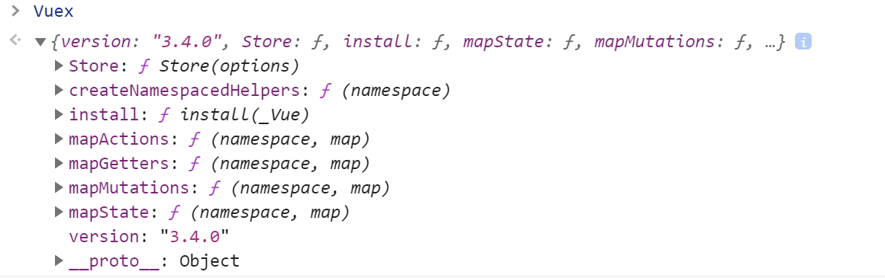

1. Vuex 的状态存储是响应式的。当 Vue 组件从 `store` 中读取状态的时候，若 `store `中的状态发生变化，那么相应的组件也会相应地得到高效更新。

2. 你不能直接改变` store `中的状态。改变 `store` 中的状态的唯一途径就是显式地**提交 (commit)` mutation`**。这样使得我们可以方便地跟踪每一个状态的变化，从而让我们能够实现一些工具帮助我们更好地了解我们的应用。我们通过提交 `mutation `的方式，而非直接改变 `store.state.count`，是因为我们想要更明确地追踪到状态的变化。这个简单的约定能够让你的意图更加明显，这样你在阅读代码的时候能更容易地解读应用内部的状态改变。此外，这样也让我们有机会去实现一些能记录每次状态改变，保存状态快照的调试工具。有了它，我们甚至可以实现如时间穿梭般的调试体验。

   由于 `store `中的状态是响应式的，在组件中调用 `store `中的状态简单到仅需要在计算属性中返回即可。触发变化也仅仅是在组件的 `methods `中提交` mutation`。

```js
const store = new Vuex.Store({
  state: {
    count: 0
  },
  mutations: {
    increment (state) {
      state.count++
    }
  }
})

store.commit('increment')
console.log(store.state.count) // -> 1
```

为了在 Vue 组件中访问 `this.$store` property，你需要为 Vue 实例提供创建好的 store。Vuex 提供了一个从根组件向所有子组件，以 `store` 选项的方式“注入”该 store 的机制：

```js
new Vue({
    el: '#app',
    store,//=store:store ES6
    methods: {
    	increment() {increment
    	this.$store.commit('increment') //调用this.$store._mutations.increment
    	console.log(this.$store.state.count)
    	}
    },
    computed:{
        count(){
            return this.$store.state.count; //用计算属性返回this.$store.state.count
        }
    }
})
```

`store`对象的内容如下:

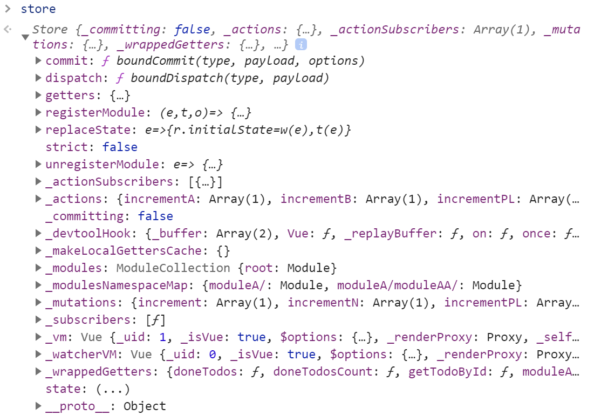

------

### Application Structure(项目结构)

Vuex 并不限制你的代码结构。但是，它规定了一些需要遵守的规则：

1. 应用层级的状态应该集中到单个**` store `**对象中。
2. 提交 **`mutation`** 是更改状态的唯一方法，并且这个过程是同步的。
3. 异步逻辑都应该封装到 **`action`** 里面。

只要你遵守以上规则，如何组织代码随你便。如果你的 **`store`** 文件太大，只需将 `action`、`mutation` 和 `getter` 分割到单独的文件。

对于大型应用，我们会希望把 `Vuex` 相关代码分割到模块中。下面是项目结构示例：

```bash
├── index.html
├── main.js
├── api
│   └── ... # 抽取出API请求
├── components
│   ├── App.vue
│   └── ...
└── store
    ├── index.js          # 我们组装模块并导出 store 的地方
    ├── actions.js        # 根级别的 action
    ├── mutations.js      # 根级别的 mutation
    └── modules
        ├── cart.js       # 购物车模块
        └── products.js   # 产品模块
```

请参考[购物车示例](https://github.com/vuejs/vuex/tree/dev/examples/shopping-cart)。[^Vuex文档structure]

------


### Core Concepts(核心概念)

#### 1.State

如[ Application Structure](#application-structure项目结构)所示,Vuex 使用**单一状态树**，用一个对象就包含了全部的应用层级状态。至此它便作为一个“唯一数据源 ([SSOT](https://en.wikipedia.org/wiki/Single_source_of_truth))”而存在。这也意味着，每个应用将仅仅包含一个 `store `实例。单一状态树让我们能够直接地定位任一特定的状态片段，在调试的过程中也能轻易地取得整个当前应用状态的快照。单状态树和模块化并不冲突,存储在 Vuex 中的数据和 Vue 实例中的 `data` 遵循相同的规则，例如状态对象必须是纯粹 (plain) 的。**参考：**[Vue#data](https://cn.vuejs.org/v2/api/#data)。

Vuex 通过 `store` 选项，提供了一种机制将状态从根组件“注入”到每一个子组件中（需调用 `Vue.use(Vuex)`）：

```js
const app = new Vue({
  el: '#app',
  // 把 store 对象提供给 “store” 选项，这可以把 store 的实例注入所有的子组件
  store,
  components: { Counter },
  template: `
    <div class="app">
      <counter></counter>
    </div>
  `
})
```

通过在根实例中注册 `store` 选项，该 store 实例会注入到根组件下的所有子组件中，且子组件能通过 `this.$store` 访问到。让我们更新下 `Counter` 的实现：

```js
const Counter = {
	template: `<div>{{ count }}</div>`,
  computed: {
    count () {
      return this.$store.state.count
    }
  }
}
```

**`mapState` 辅助函数**

当一个组件需要获取多个状态的时候，将这些状态都声明为计算属性会有些重复和冗余。为了解决这个问题，我们可以使用 `mapState` 辅助函数帮助我们生成计算属性:

```js
let { mapState } = Vuex;//解构Vuex中的mapState方法 ES6

state: {
  count: 0,
  todos: [
    { id: 1, text: '...', done: true },
    { id: 2, text: '...', done: false }
  ],
}
```

```js
1.
computed: mapState({
  // 箭头函数可使代码更简练
  count: state => state.count,
  // 传字符串参数 'count' 等同于 `state => state.count` countAlias = count
  countAlias: 'count',
  count2: 'count',
  // 为了能够使用 `this` 获取局部状态，必须使用常规函数
  countPlusLocalState(state) {
      return state.count + this.localCount
  }
}) // mapState返回的是一个对象,将该对象赋值给computed

2.
computed: mapState([
  // 映射 this.count 为 store.state.count
  'count','todos'
]),
```

我们如何将它与局部计算属性混合使用呢？通常，我们需要使用一个工具函数将多个对象合并为一个，以使我们可以将最终对象传给 `computed` 属性。但是自从有了[对象展开运算符](https://github.com/tc39/proposal-object-rest-spread)，我们可以极大地简化写法:

```js
data() {
  return {
      localCount: 4
  }
},
computed:{
  countPlusLocalState() {
      return this.localCount;
  },
  ...mapState([
      // 映射 this.count 为 store.state.count
      'count',
      "todos"
  ]),
}
```

使用 Vuex 并不意味着你需要将**所有的**状态放入 Vuex。虽然将所有的状态放到 Vuex 会使状态变化更显式和易调试，但也会使代码变得冗长和不直观。如果有些状态严格属于单个组件，最好还是作为组件的局部状态。你应该根据你的应用开发需要进行权衡和确定。

#### Getter

有时候我们需要从 store 中的 state 中派生出一些状态，例如对列表进行过滤并计数：

```js
computed: {
  doneTodosCount () {
    return this.$store.state.todos.filter(todo => todo.done).length
  }
}
```

如果有多个组件需要用到此属性，我们要么复制这个函数，或者抽取到一个共享函数然后在多处导入它——无论哪种方式都不是很理想。

`Vuex` 允许我们在 `store` 中定义“`getter`”（可以认为是 `store` 的计算属性）。就像计算属性一样，`getter` 的返回值会根据它的依赖被**缓存**起来，且只有当它的**依赖值**发生了改变才会被**重新计算**。

`Getter `接受` state` 作为其第一个参数：

```js
const store = new Vuex.Store({
  state: {
    todos: [
      { id: 1, text: '...', done: true },
      { id: 2, text: '...', done: false }
    ]
  },
  getters: {
    doneTodos: state => {
      return state.todos.filter(todo => todo.done)
    }
  }
})
```

**通过属性访问**

`Getter `会暴露为 `store.getters` 对象，你可以以属性的形式访问这些值：

```js
store.getters.doneTodos // -> [{ id: 1, text: '...', done: true }]
```

`Getter `也可以接受其他`getter` 作为第二个参数：

```js
getters: {
  doneTodos: state => {
      return state.todos.filter(todo => todo.done)
    },
  doneTodosCount: (state, getters) => {
    return getters.doneTodos.length
  }
}
```

```js
store.getters.doneTodosCount // -> 1
```

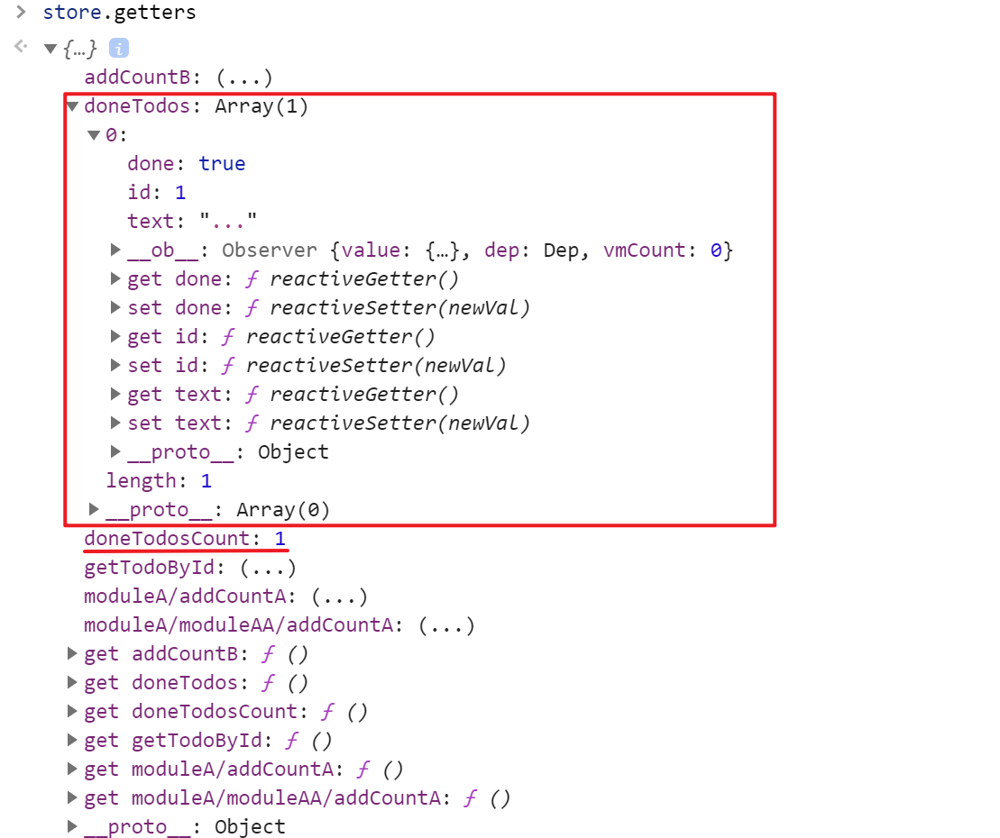

我们可以很容易地在任何组件中使用它：

```js
computed: {
  doneTodosCount () {
    return this.$store.getters.doneTodosCount
  }
}
```

**通过方法访问**

你也可以通过让 getter 返回一个函数，来实现给 getter 传参。在你对 store 里的数组进行查询时非常有用。

```js
getters: {
  // ...
  getTodoById: (state) => (id) => {
    return state.todos.find(todo => todo.id === id)
  }
}
```

```js
store.getters.getTodoById(2) // -> { id: 2, text: '...', done: false }
```

```js
getTodoById: (state) => (id) => {
  return state.todos.find(todo => todo.id === id)
}
等价于
getTodoById(state){
  return function(id){
    return state.todos.find(todo => todo.id === id)
  }
}
//store.getters.getTodoById的返回值为
//function(id){
//  return state.todos.find(todo => todo.id === id)
//}
let getTodoById = store.getters.getTodoById
getTodoById(2)
//store.getters.getTodoById(2)
```

**注意**，`getter` 在通过方法访问时，每次都会去进行调用，而不会缓存结果。

**`mapGetters` 辅助函数**

`mapGetters` 辅助函数仅仅是将 store 中的 getter 映射到局部计算属性：

```js
let {mapGetters} Vuex;//解构Vuex中的mapGetters方法

data() {
  return {
      localCount: 4
  }
},
computed:{
 //...
  ...mapGetters(["doneTodos", "doneTodosCount"]),
}

```

如果你想将一个 getter 属性另取一个名字，使用对象形式：

```js
computed:{
 //...
  ...mapGetters({ getID: "getTodoById" }),
}
```

#### Mutation

更改 Vuex 的 store 中的状态的唯一方法是提交 `mutation`。Vuex 中的 `mutation` 非常类似于事件：每个 `mutation` 都有一个字符串的 **事件类型 (`type`)** 和 一个 **回调函数 (`handler`)**。这个回调函数就是我们实际进行状态更改的地方，并且它会接受 `state `作为第一个参数[见start](#Start)

**提交载荷（Payload）**

```js
mutations:{
  //...
  incrementN(state, n) {
    console.log(`n的值为:${n}`);
    n += state.count;
    console.log(`n的值为:${n}`);
    console.log(`state.count+n的值:${n}`);
	},
}

store.commit('incrementN', 10)
```

在大多数情况下，载荷应该是一个对象，这样可以包含多个字段并且记录的 mutation 会更易读：

```js
mutations:{
  //...
	incrementPL(state, payLoad) {
    console.log(`state.count的值为:${state.count}`);
    console.log(`payLoad.n的值为:${payLoad.n}`);
    payLoad.n += state.count;
    console.log(`payLoad.n的值:${payLoad.n}`);
	},
}  n

store.commit('inPLcrementPL', {
  n:10
})
```

**对象风格的提交方式**

提交 mutation 的另一种方式是直接使用包含 `type` 属性的对象：

```js
store.commit({
  type: 'incrementPL',
  n: 10
})
```

当使用对象风格的提交方式，整个对象都作为载荷传给 mutation 函数，因此 handler 保持不变.

**Mutation 需遵守 Vue 的响应规则**

既然 Vuex 的 store 中的状态是响应式的，那么当我们变更状态时，监视状态的 Vue 组件也会自动更新。这也意味着 Vuex 中的 mutation 也需要与使用 Vue 一样遵守一些注意事项：

1. 最好提前在你的 store 中初始化好所有所需属性。
2. 当需要在对象上添加新属性时，你应该

- 使用 `Vue.set(obj, 'newProp', 123)`, 或者
- 以新对象替换老对象。例如，利用[对象展开运算符](https://github.com/tc39/proposal-object-rest-spread)我们可以这样写:

- ```js
  state.obj = { ...state.obj, newProp: 123 }
  ```

**使用常量替代 Mutation 事件类型**

使用常量替代 mutation 事件类型在各种 Flux 实现中是很常见的模式。这样可以使 linter 之类的工具发挥作用，同时把这些常量放在单独的文件中可以让你的代码合作者对整个 app 包含的 mutation 一目了然:

```js
// mutation-types.js
export const SOME_MUTATION = 'SOME_MUTATION'
```


```js
// store.js
import Vuex from 'vuex'
import { SOME_MUTATION } from './mutation-types'

const store = new Vuex.Store({
  state: { ... },
  mutations: {
    // 我们可以使用 ES2015(ES6)风格的计算属性命名功能来使用一个常量作为函数名
    [SOME_MUTATION] (state) {
      // mutate state
    }
  }
})
```

**Mutation 必须是同步函数**

一条重要的原则就是要记住 **mutation 必须是同步函数**。为什么？请参考下面的例子：

```js
mutations: {
  someMutation (state) {
    api.callAsyncMethod(() => {
      state.count++
    })
  }
}
```

现在想象，我们正在 debug 一个 app 并且观察 devtool 中的 mutation 日志。每一条 mutation 被记录，devtools 都需要捕捉到前一状态和后一状态的快照。然而，在上面的例子中 mutation 中的异步函数中的回调让这不可能完成：因为当 mutation 触发的时候，回调函数还没有被调用，devtools 不知道什么时候回调函数实际上被调用——实质上任何在回调函数中进行的状态的改变都是不可追踪的。

```js
import { mapMutations } from 'vuex'
//let { maptations } = Vuex;

methods:{
    ...mapMutations([
      'increment', // 将 `this.increment()` 映射为 `this.$store.commit('increment')`

      // `mapMutations` 也支持载荷：
      'incrementN' // 将 `this.incrementN(n)` 映射为 `this.$store.commit('incrementN', n)`
    ]),
    ...mapMutations({
      add: 'incrementPL' // 将 `this.add()` 映射为 `this.$store.commit('incrementPL',payLoad)`
    })
  }
}
```

#### Action

`Action `类似于 `mutation`，不同在于：

- Action 提交的是 mutation，而不是直接变更状态。
- Action 可以包含任意异步操作。

让我们来注册一个简单的 action：

```js
const store = new Vuex.Store({
  state: {
    count: 0
  },
  mutations: {
    increment (state) {
      state.count++
    }
  },
  actions: {
    increment (context) {
      context.commit('increment')
    }
  }
})
```

`Action` 函数接受一个与 store 实例具有相同方法和属性的`context` 对象，因此你可以调用 `context.commit` 提交一个 mutation，或者通过 `context.state` 和 `context.getters` 来获取 `state` 和 `getters`。当我们在之后介绍到 [Modules](https://vuex.vuejs.org/zh/guide/modules.html) 时，你就知道 `context `对象为什么不是 `store `实例本身了。

实践中，我们会经常用到 ES2015 的 [参数解构](https://github.com/lukehoban/es6features#destructuring) 来简化代码（特别是我们需要调用 `commit` 很多次的时候）：

```js
actions: {
  increment ({ commit }) {
    commit('increment')
  }
}
```

**分发 Action** 

Action 通过 `store.dispatch` 方法触发：

```js
store.dispatch('increment')
```

乍一眼看上去感觉多此一举，我们直接分发 mutation 岂不更方便？实际上并非如此，还记得 **mutation 必须同步执行**这个限制么？Action 就不受约束！我们可以在 action 内部执行**异步**操作：

```js
actions: {
  incrementAsync ({ commit }) {
    setTimeout(() => {
      commit('increment')
    }, 1000)
  }
}
```

Actions 支持同样的载荷方式和对象方式进行分发：

```js
// 以载荷形式分发
store.dispatch('incrementAsync', {
  amount: 10
})

// 以对象形式分发
store.dispatch({
  type: 'incrementAsync',
  amount: 10
})
```

来看一个更加实际的购物车示例，涉及到**调用异步 API** 和**分发多重 mutation**：

```js
actions: {
  checkout ({ commit, state }, products) {
    // 把当前购物车的物品备份起来
    const savedCartItems = [...state.cart.added]
    // 发出结账请求，然后乐观地清空购物车
    commit(types.CHECKOUT_REQUEST)
    // 购物 API 接受一个成功回调和一个失败回调
    shop.buyProducts(
      products,
      // 成功操作
      () => commit(types.CHECKOUT_SUCCESS),
      // 失败操作
      () => commit(types.CHECKOUT_FAILURE, savedCartItems)
    )
  }
}
```

注意我们正在进行一系列的异步操作，并且通过提交 mutation 来记录 action 产生的副作用（即状态变更）。

**在组件中分发 Action**

你在组件中使用 `this.$store.dispatch('xxx')` 分发 action，或者使用 `mapActions` 辅助函数将组件的 methods 映射为 `store.dispatch` 调用（需要先在根节点注入 `store`）：

```js
import { mapActions } from 'vuex'
//let {mapActions} = Vuex;

export default {
  // ...
  methods: {
    ...mapActions([
      'increment', // 将 `this.increment()` 映射为 `this.$store.dispatch('increment')`

      // `mapActions` 也支持载荷：
      'incrementN' // 将 `this.incrementBy(n)` 映射为 `this.$store.dispatch('incrementBy', n)`
    ]),
    ...mapActions({
      add: 'incrementPL' // 将 `this.add()` 映射为 `this.$store.dispatch('incrementPL',payLoad)`
    })
  }
}
```

**组合 Action**

Action 通常是异步的，那么如何知道 action 什么时候结束呢？更重要的是，我们如何才能组合多个 action，以处理更加复杂的异步流程？

首先，你需要明白 `store.dispatch` 可以处理被触发的 action 的处理函数返回的 Promise，并且 `store.dispatch` 仍旧返回 Promise：

```js
actions: {
  actionA ({ commit }) {
    return new Promise((resolve, reject) => {
      setTimeout(() => {
        commit('someMutation')
        resolve()
      }, 1000)
    })
  }
}
```

现在你可以：

```js
store.dispatch('actionA').then(() => {
  // ...
})
```

在另外一个 action 中也可以：

```js
actions: {
  // ...
  actionB ({ dispatch, commit }) {
    return dispatch('actionA').then(() => {
      commit('someOtherMutation')
    })
  }
}
```

最后，如果我们利用 [async / await](https://tc39.github.io/ecmascript-asyncawait/)，我们可以如下组合 action：

```js
// 假设 getData() 和 getOtherData() 返回的是 Promise

actions: {
  async actionA ({ commit }) {
    commit('gotData', await getData())
  },
  async actionB ({ dispatch, commit }) {
    await dispatch('actionA') // 等待 actionA 完成
    commit('gotOtherData', await getOtherData())
  }
}
```

> 一个 `store.dispatch` 在不同模块中可以触发多个 action 函数。在这种情况下，只有当所有触发函数完成后，返回的 Promise 才会执行。[^Vuex文档Action]

#### Modules(模块)

由于使用单一状态树，应用的所有状态会集中到一个比较大的对象。当应用变得非常复杂时，store 对象就有可能变得相当臃肿。

为了解决以上问题，Vuex 允许我们将 store 分割成**模块（module）**。每个模块拥有自己的 state、mutation、action、getter、甚至是嵌套子模块——从上至下进行同样方式的分割：

```js
const moduleA = {
  state: () => ({ ... }),
  mutations: { ... },
  actions: { ... },
  getters: { ... }
}

const moduleB = {
  state: () => ({ ... }),
  mutations: { ... },
  actions: { ... }
}

const store = new Vuex.Store({
  modules: {
    moduleA,
    moduleB
  }
})

store.state.moduleA // -> moduleA 的状态
store.state.moduleB // -> moduleB 的状态
```

state对象的内容如下:

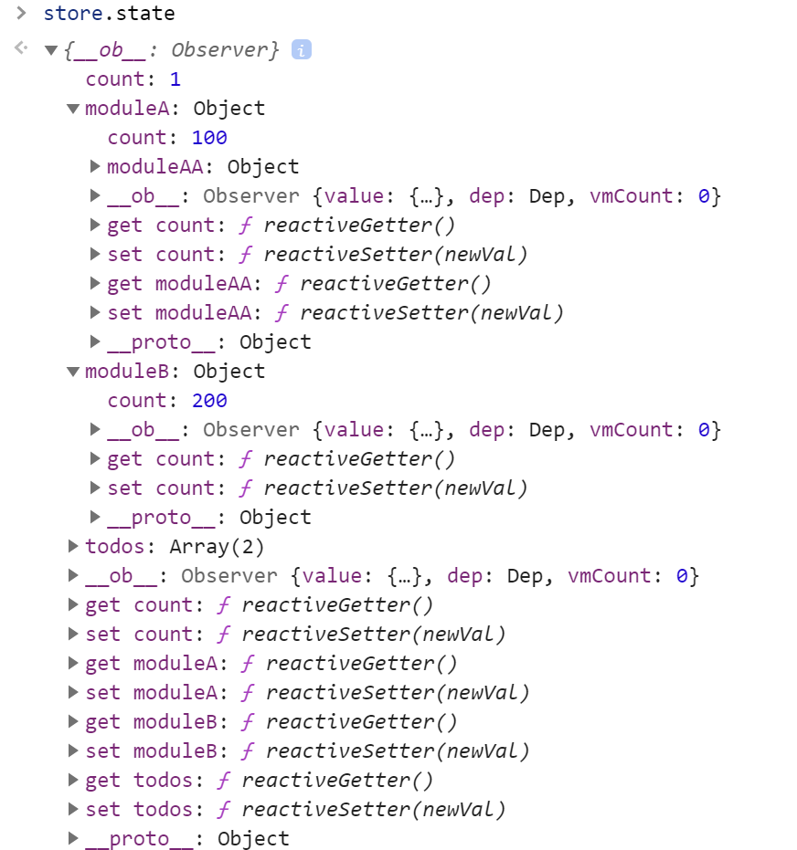

**Module Local State(模块的局部状态)**

对于模块内部的 mutation 和 getter，接收的第一个参数是**模块的局部状态对象**。同样，对于模块内部的 action，局部状态通过 `context.state` 暴露出来，根节点状态则为 `context.rootState`,对于模块内部的 getter，根节点状态会作为第三个参数暴露出来：

```js
const moduleA = {
  state() {
      return { count: 100 };
  },
  getters: {
      addCountA(state, getters, rootState, rootGetters) {
          console.log(`state.count的值为${state.count}`);
          console.log(`rootState.count的值为${rootState.count}`);
          console.log(`rootGetters.addCountB的值为${rootGetters.addCountB}`);
          return state.count + rootState.count;
      }//在moduleA添加`namespaced: true`的情况下,用store.getters["moduleA/addCountA"]来调用;
  },
  mutations: {
      incrementN(state, n) {
          console.log(`n的值为:${n}`);
          n += state.count;
          console.log(`n的值为:${n}`);
          console.log(`state.count+n的值:${n}`);
      },
      [`${increment}PL`](state, payLoad) {
          console.log(`state.count的值为:${state.count}`);
          console.log(`payLoad.n的值A为:${payLoad.n}`);
          return console.log(`moduleA中的incrementPL输出state.count+payLoad.n为:${state.count + payLoad.n}`);
      },//在默认情况下,module中的mutations的属性名可以与store中的重名,重名函数会以数组形式出现在store._mutations中,且共用一个payload,即module中的函数调用时即使传入payLoad也是无效的,当添加`namespaced: true`后,用store.commit("moduleA/incrementPL",{n:10})来调用.
      [`${increment}ModuleA`](state, payLoad) {
          return console.log(state.count + payLoad.n);
      }
  },
  actions: {
      [`${increment}PL`]({ commit, rootState, rootGetters }, payLoad) {
          // console.log(arguments);
          console.log(`rootstate.count:${rootState.count}`);
          console.log(`rootGetters.addCountB:${rootGetters.addCountB}`);
          commit(`${increment}PL`, payLoad);
      },//默认情况下,module中的actions的属性名可以与store中的重名,重名函数会以数组形式出现在store._actions中,且共用一个payload,即module中的函数调用时即使传入payLoad也是无效的
  }
}
```

**Namespacing(命名空间)**

默认情况下，模块内部的 `action`、``mutation` 和 `getter `是注册在**全局命名空间**的——这样使得多个模块能够对同一 `mutation` 或 `action `作出响应,且会出现同名函数,重名函数会以数组形式储存,调用该函数名会调用所有重名函数,当传入的参数是`payload`的形式,会共用`payload`。

**`getters`:**

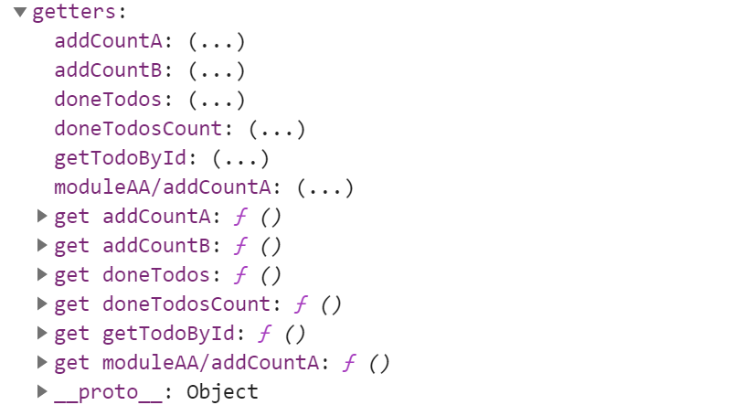

`mutations`:

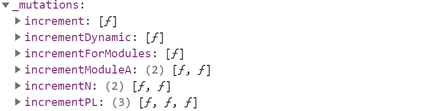

`actions`:

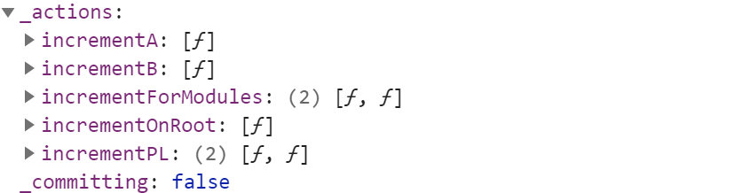

如果希望你的模块具有更高的封装度和复用性，你可以通过添加 `namespaced: true` 的方式使其成为带命名空间的模块。当模块被注册后，它的所有 getter、action 及 mutation 都会自动根据模块注册的路径调整命名。例如：

```js
const moduleA = {
	namespaced: true,//默认情况下，模块内部的 action、mutation 和 getter 是注册在全局命名空间的——这样使得多个模块能够对同一 mutation 或 action 作出响应,添加该属性使得该模块成为带命名空间的模块。当模块被注册后，它的所有 getter、action 及 mutation 都会自动根据模块注册的路径调整命名。
  state:()=>{
    
  },
  //...
}
```

启用了命名空间的 getter 和 action 会收到局部化的 `getter`，`dispatch` 和 `commit`。换言之，你在使用模块内容（module assets）时不需要在同一模块内额外添加空间名前缀。更改 `namespaced` 属性后不需要修改模块内的代码。

**`getters`:**

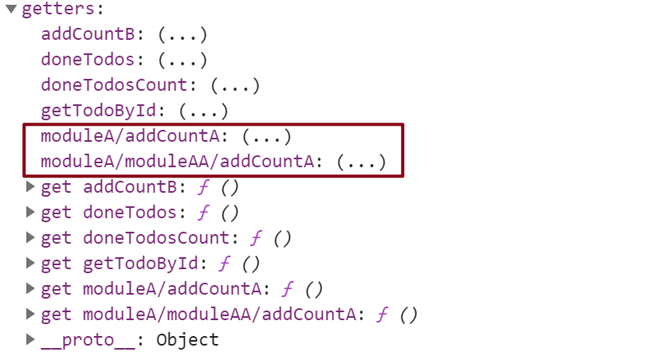

`mutations`:

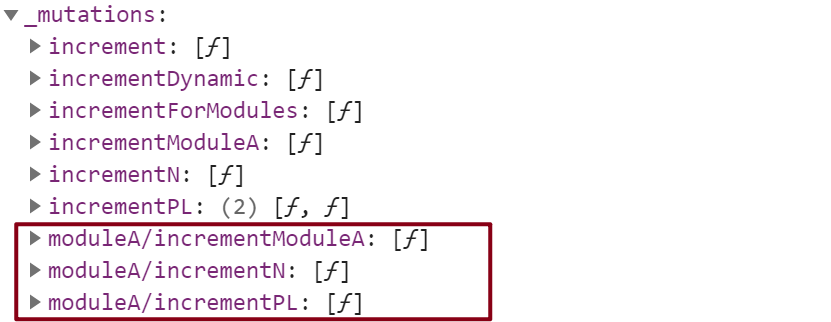

`actions`:

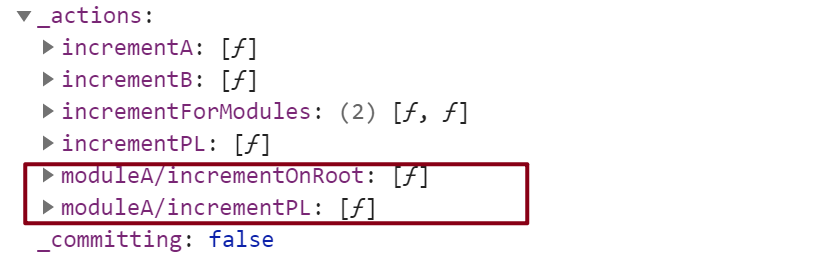

```js
//调用局部模块
store.getters["moduleA/addCountA"];
store.commit("moduleA/incrementPL",{n:100});
store.dispatch("moduleA/incrementPL",{n:200});
```

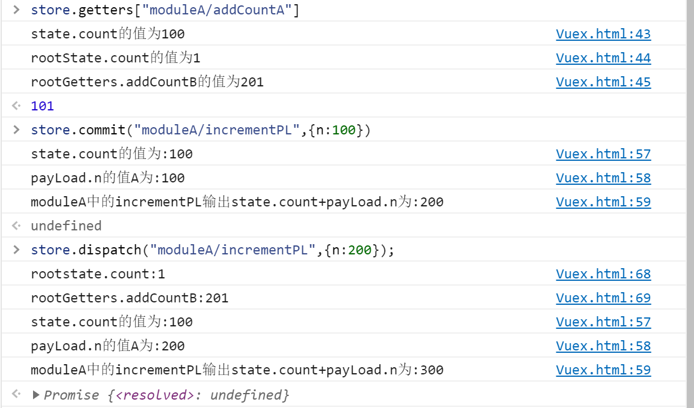

**在带命名空间的模块内访问全局内容（Global Assets）**

如果你希望使用全局 state 和 getter，`rootState` 和 `rootGetters` 会作为第三和第四参数传入 getter，也会通过 `context` 对象的属性传入 action。

若需要在全局命名空间内分发 action 或提交 mutation，将 `{ root: true }` 作为第三参数传给 `dispatch` 或 `commit` 即可。

```js
const moduleA = {
  //...
  actions:{
	  [`${increment}OnRoot`]({ commit, dispatch }, payLoad) {
          commit("incrementForModules", payLoad, { root: true });
          dispatch("incrementForModules", payLoad, { root: true });
     },  
	}
  //...
}

const store = new Vuex.Store({
  namespaced:true,
  //...
  mutations:{
    [`${increment}ForModules`](state, payLoad) {
      console.log(payLoad);
      console.log("this is global mutation for modules");
    }
  },
  actions:{
    [`${increment}ForModules`]({ commit, dispatch }, payLoad) {
      console.log(payLoad);
      console.log("this is global action for modules");
    }
  }
  //...
})

store.dispatch('moduleA/incrementOnRoot',{name:"a"})
//Vuex.html:150 {name: "a"}
//Vuex.html:151 this is global mutation for modules
//Vuex.html:186 {name: "a"}
//Vuex.html:187 this is global action for modules
```

**在带命名空间的模块注册全局 action**

若需要在带命名空间的模块注册全局 action，你可添加 `root: true`，并将这个 action 的定义放在函数 `handler` 中。例如：

```js
const moduleA = {
  namespaced:true,
  //...
  actions:{
    //...
    [`${increment}ForModules`]: {
    	root: true,//在带命名空间的模块注册全局 action
    	handler(context, payLoad) {
        console.log(1);
    	}
		}
    //...
  },
 	//... 
}

store.dispatch("incrementForModules",null)
//Vuex.html:186 null
//Vuex.html:187 this is global action for modules
//Vuex.html:79 1
```

**带命名空间的绑定函数**

当使用 `mapState`, `mapGetters`, `mapActions` 和 `mapMutations` 这些函数来绑定带命名空间的模块时，写起来可能比较繁琐：

```js
...mapState({ countA: state => state.moduleA.count }),
...mapMutations([`moduleA/${increment}ModuleA`]),
...mapMutations({ [`${increment}ModuleA`]: `moduleA/${increment}ModuleA` }),
```

对于这种情况，你可以将模块的空间名称字符串作为第一个参数传递给上述函数，这样所有绑定都会自动将该模块作为上下文。于是上面的例子可以简化为：

```js
...mapState("moduleA/moduleAA",["count"]),
...mapState("moduleA/moduleAA", { ["countAA"]: state => state.count }),
...mapActions(`moduleA`, [`${increment}OnRoot`]),
//...map---("moduleName",object/array)
```

而且，你可以通过使用 `createNamespacedHelpers` 创建基于某个命名空间辅助函数。它返回一个对象，对象里有新的绑定在给定命名空间值上的组件绑定辅助函数：

```js
import { createNamespacedHelpers } from 'vuex'
//let createNamespacedHelpers = Vuex.createNamespacedHelpers;
const { mapState, mapActions } = createNamespacedHelpers('some/nested/module')

export default {
  computed: {
    // 在 `some/nested/module` 中查找
    ...mapState({
      a: state => state.a,
      b: state => state.b
    })
  },
  methods: {
    // 在 `some/nested/module` 中查找
    ...mapActions([
      'foo',
      'bar'
    ])
  }
}
```

**给插件开发者的注意事项**

如果你开发的[插件（Plugin）](https://vuex.vuejs.org/zh/guide/plugins.html)提供了模块并允许用户将其添加到 Vuex store，可能需要考虑模块的空间名称问题。对于这种情况，你可以通过插件的参数对象来允许用户指定空间名称：

```js
// 通过插件的参数对象得到空间名称
// 然后返回 Vuex 插件函数
export function createPlugin (options = {}) {
  return function (store) {
    // 把空间名字添加到插件模块的类型（type）中去
    const namespace = options.namespace || ''
    store.dispatch(namespace + 'pluginAction')
  }
}
```

**模块动态注册**

在 store 创建**之后**，你可以使用 `store.registerModule` 方法注册模块：

```js
import Vuex from 'vuex'

const store = new Vuex.Store({ /* 选项 */ })

// 注册模块 `myModule`
store.registerModule('myModule', {
  // ...
})
// 注册嵌套模块 `nested/myModule`
store.registerModule(['nested', 'myModule'], {
  // ...
})
```

之后就可以通过 `store.state.myModule` 和 `store.state.nested.myModule` 访问模块的状态。

模块动态注册功能使得其他 Vue 插件可以通过在 store 中附加新模块的方式来使用 Vuex 管理状态。例如，[`vuex-router-sync`](https://github.com/vuejs/vuex-router-sync) 插件就是通过动态注册模块将 vue-router 和 vuex 结合在一起，实现应用的路由状态管理。

你也可以使用 `store.unregisterModule(moduleName)` 来动态卸载模块。注意，你不能使用此方法卸载静态模块（即创建 store 时声明的模块）。

注意，你可以通过 `store.hasModule(moduleName)` 方法检查该模块是否已经被注册到 store。

**模块重用**

有时我们可能需要创建一个模块的多个实例，例如：

- 创建多个 store，他们公用同一个模块 (例如当 `runInNewContext` 选项是 `false` 或 `'once'` 时，为了[在服务端渲染中避免有状态的单例](https://ssr.vuejs.org/en/structure.html#avoid-stateful-singletons))
- 在一个 store 中多次注册同一个模块

如果我们使用一个纯对象来声明模块的状态，那么这个状态对象会通过引用被共享，导致状态对象被修改时 store 或模块间数据互相污染的问题。

实际上这和 Vue 组件内的 `data` 是同样的问题。因此解决办法也是相同的——使用一个函数来声明模块状态（仅 2.3.0+ 支持）：

```js
const MyReusableModule = {
  state: () => ({
    foo: 'bar'
  }),
  // mutation, action 和 getter 等等...
}
```

------


### Strict Mode(严格模式)

开启严格模式，仅需在创建 store 的时候传入 `strict: true`：

```js
const store = new Vuex.Store({
  // ...
  strict: true
})
```

在严格模式下，无论何时发生了状态变更且不是由 mutation 函数引起的，将会抛出错误。这能保证所有的状态变更都能被调试工具跟踪到。

#### [#](https://vuex.vuejs.org/zh/guide/strict.html#开发环境与发布环境)开发环境与发布环境

**不要在发布环境下启用严格模式**！严格模式会深度监测状态树来检测不合规的状态变更——请确保在发布环境下关闭严格模式，以避免性能损失。

类似于插件，我们可以让构建工具来处理这种情况：

```js
const store = new Vuex.Store({
  // ...
  strict: process.env.NODE_ENV !== 'production'
})
```

------


### Form Handling(表单处理)

当在严格模式中使用 Vuex 时，在属于 Vuex 的 state 上使用 `v-model` 会比较棘手：

```html
<input v-model="obj.message">
```

假设这里的 `obj` 是在计算属性中返回的一个属于 Vuex store 的对象，在用户输入时，`v-model` 会试图直接修改 `obj.message`。在严格模式中，由于这个修改不是在 mutation 函数中执行的, 这里会抛出一个错误。

用“Vuex 的思维”去解决这个问题的方法是：给 `<input>` 中绑定 value，然后侦听 `input` 或者 `change` 事件，在事件回调中调用一个方法:

```html
<input :value="message" @input="updateMessage">
```

```js
// ...
computed: {
  ...mapState({
    message: state => state.obj.message
  })
},
methods: {
  updateMessage (e) {
    this.$store.commit('updateMessage', e.target.value)
  }
}
```

下面是 mutation 函数：

```js
// ...
mutations: {
  updateMessage (state, message) {
    state.obj.message = message
  }
}
```

#### [#](https://vuex.vuejs.org/zh/guide/forms.html#双向绑定的计算属性)双向绑定的计算属性

必须承认，这样做比简单地使用“`v-model` + 局部状态”要啰嗦得多，并且也损失了一些 `v-model` 中很有用的特性。另一个方法是使用带有 setter 的双向绑定计算属性：

```html
<input v-model="message">
// ...
computed: {
  message: {
    get () {
      return this.$store.state.obj.message
    },
    set (value) {
      this.$store.commit('updateMessage', value)
    }
  }
}
```

------


### Plugins(插件):[见文档](https://vuex.vuejs.org/zh/guide/plugins.html)

### Testing(测试):[见文档](https://vuex.vuejs.org/zh/guide/testing.html)

### Hot Reloading(热重载):[见文档](https://vuex.vuejs.org/zh/guide/hot-reload.html)

------


[^Vuex文档structure]:https://vuex.vuejs.org/zh/guide/structure.html
[^Vuex文档Action]:<u>https://vuex.vuejs.org/zh/guide/actions.html</u>